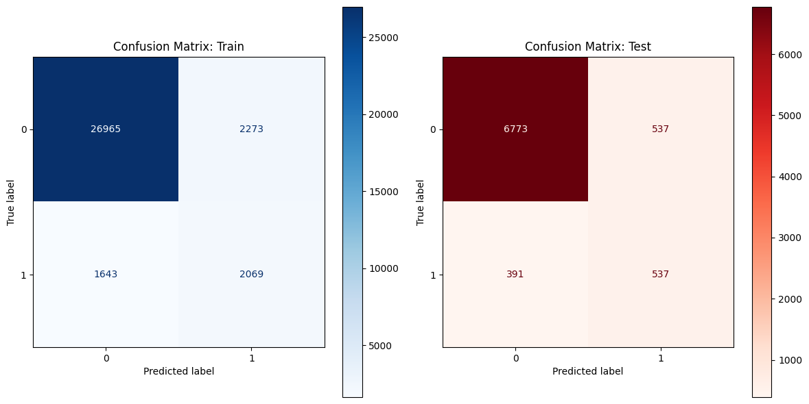
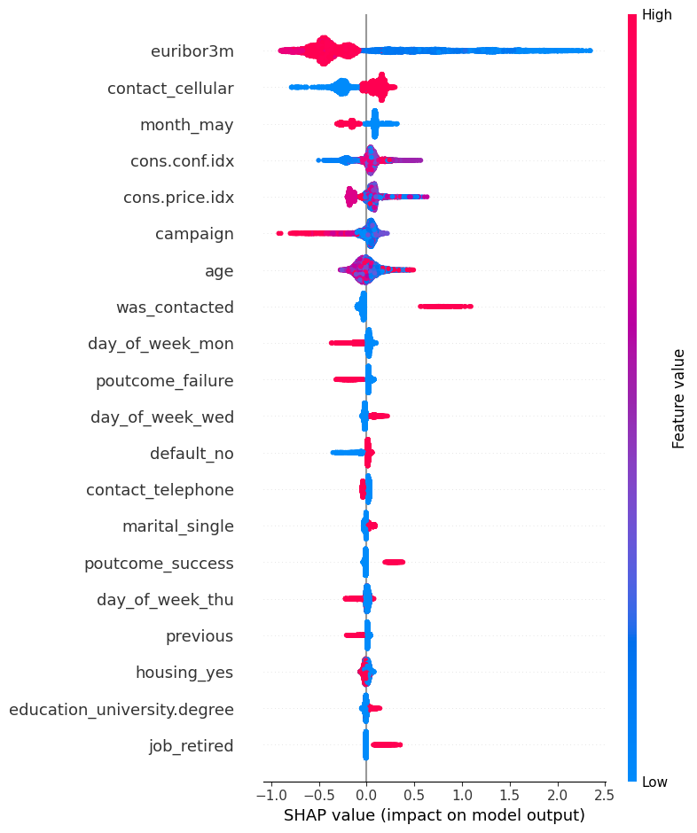

# Predicting Bank Deposit Sign-ups (Bank Marketing Campaign)

## 📌 Task Description
This project focuses on analysing the marketing campaigns of a Portuguese banking institution. The main objective is to predict whether a customer will open a fixed-term deposit (target variable `y`).

**Business objective:** To reduce the number of ineffective calls and focus efforts on customers who are most likely to agree to the service.

## 🛠 What was done
During the project, the full ML model development cycle was carried out:
- **Data cleaning:** Handling missing values and removing the `duration` feature (to prevent data leakage).
- **EDA:** Visualising class distributions and feature correlations.
- **Feature engineering:** Encoding categorical variables and scaling numerical features.
- **Modelling:** Four models were trained (Logistic Regression, kNN, Decision Tree, LightGBM).
- **Optimisation:** `Hyperopt` and `RandomizedSearchCV` were used to find the best hyperparameters.
- **Pipeline:** Custom functions were created in `src/utils.py` and a final pipeline was built to automate data processing.

## 📊 Experiment results

| Model | ROC-AUC (Test) | F1-Score (Test) | Comment |
| :--- | :---: | :---: | :--- |
| **LightGBM (Tuned)** | **0.81** | **0.54** | Best balance of Recall and Precision |
| Decision Tree | 0.80 | 0.47 | A stable model, but outperformed by boosting |
| Logistic Regression | 0.80 | 0.46 | A good baseline |
| kNN | 0.74 | 0.40 | Sensitive to class imbalance |

### 📈 Confusion Matrix


## 🔍 Model Interpretation (SHAP)
SHAP analysis was used to explain the LightGBM model’s decisions. 



**The most important features were:**
1. `euribor3m` (macroeconomic indicator).
2. `nr.employed` (number of employees).
3. `poutcome_success` (success of the previous campaign).

## 💡 Conclusions and next steps
- The model performs consistently on the test data.
- To improve results, it is recommended to collect more data on customers’ transaction history.
- Implementing the model will optimise the marketing department’s performance by ~60%.

## How to get started

1. Clone the repository:
```bash
git clone https://github.com/zorginet/Mid-term-project.git
```
2. Install the required libraries:
```bash
pip install -r requirements.txt
```
3. Open and run the notebook:
```bash
jupyter notebook notebooks/Mid_term_Project.ipynb
```